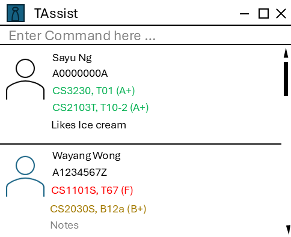

# TAssist

* **TAssist** is a desktop application for **university Computer Science tutors** to manage the students in their tutorial groups across multiple modules.
  * It is optimized for tutors who **prefer typing**: all actions are done through a Command Line Interface (CLI).
  * It is written in Java and has about 9 KLoC.
* Main features:
  * Add, edit, delete and search for students (by name or matriculation number)
  * Filter students by module and class
  * Record grades, sort by grades, and view class statistics
  * Mark and view attendance for each tutorial
  * Track assignment submissions
  * View a student's profile: particulars, grades, attendance and assignment metrics
  * Import and export student data
  * Undo and redo mistakes, and reuse previous commands
* Target users: tutors handling several modules or lab sections who need to look up and compare student information quickly.
* For the detailed documentation of this project, see the **[TAssist Product Website](https://ay2627s1-cs2103t-t10-2.github.io/tp/)**.
