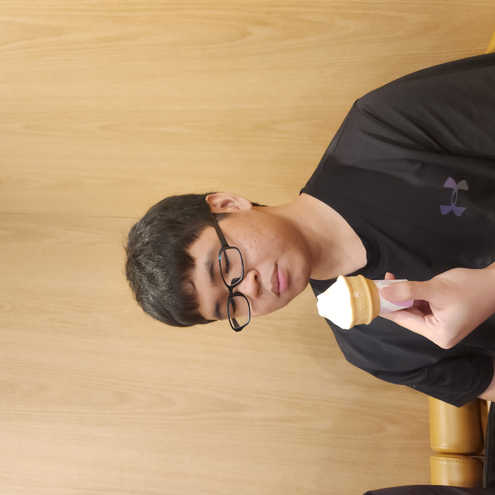
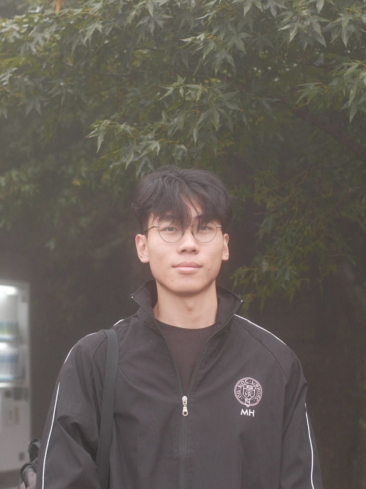
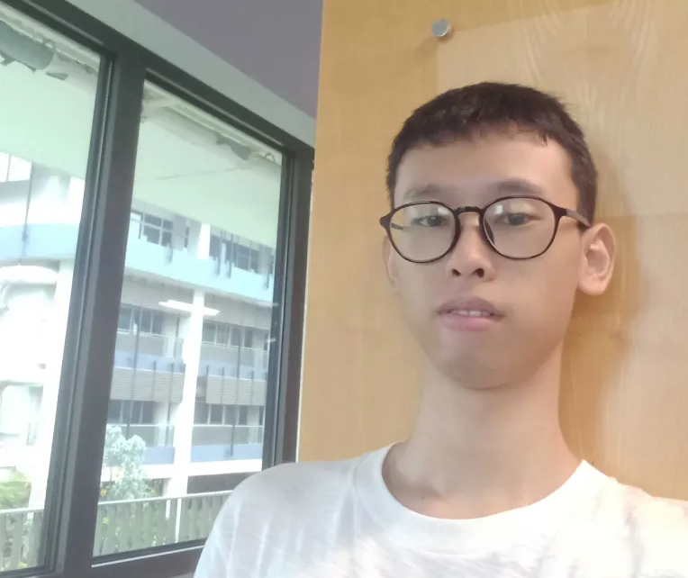

# About Us

We are a team based in the [School of Computing, National University of Singapore](http://www.comp.nus.edu.sg).

You can reach us at the email `seer[at]comp.nus.edu.sg`

## Project team

### Adrian Luah Jun Kang

[[github](https://github.com/adriazz)]

* Role: Developer
* Responsibilities: Scheduling and tracking + Model

### Jane Doe

[[github](http://github.com/johndoe)]
[[portfolio](team/johndoe.md)]

* Role: Team Lead
* Responsibilities: UI

### Johnny Doe

[[github](http://github.com/johndoe)] [[portfolio](team/johndoe.md)]

* Role: Developer
* Responsibilities: Data

### Jean Doe

[[github](http://github.com/johndoe)]
[[portfolio](team/johndoe.md)]

* Role: Developer
* Responsibilities: Dev Ops + Threading

### Minhong

[[github](https://github.com/coffee-678)]

* Role: Developer
* Responsibilities: Documentation + Commons

### Jiang Yuzhe

[[github](http://github.com/f1r8)]

* Role: Team Lead
* Responsibilities: Testing + Logic
